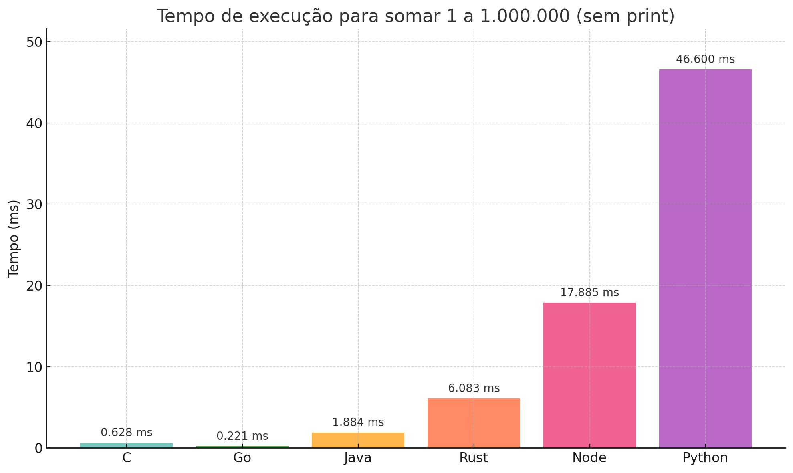

# Programming Languages Benchmarks

This repository contains benchmarks for various programming languages.

# Supported Languages

- C
- Rust
- Go
- Python
- JavaScript
- Java

# Comparison

## Iteration Results

### Graphics

### Table

| Language   | Speed (ms) |
| ---------- | ---------- |
| C          | 0.628      |
| Rust       | 6.083      |
| Go         | 0.221      |
| Python     | 46.60      |
| JavaScript | 17.88      |
| Java       | 1.884      |
